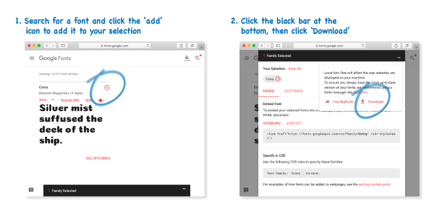
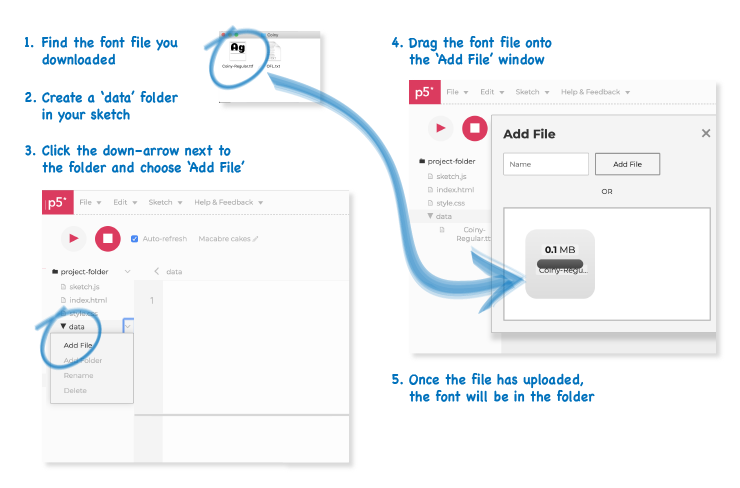
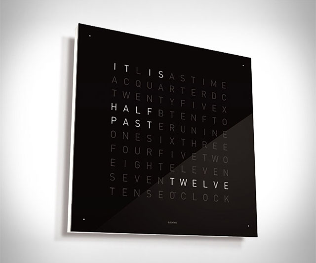

  In this week’s tutorial we'll work with Fonts and Text in
  p5.js and use time as an input for your sketches. This is the last
  in-class activity that'll form part of the assignment 1 submission. The
  sketch for this part of the assignment must
  involve drawing some text to the screen and it must change over time,
  without user input. You will learn some ways to do this in this tutorial.

## Text as data in p5.js

We've already seen some of the ways to use text
as data in Processing. You should now be familiar with code such as
the following:


// Initialize two strings.
let c = 'h';
let myString = "Hello World.";


<!-- TODO: Revise this for JavaScript, need to check MDN -->
<!-- https://developer.mozilla.org/en-US/docs/Web/JavaScript/Reference/Global_Objects/String -->

The [`String`][2] class in JavaScript lets us store single letters and whole
words and sentences --- _strings_ of characters.

There're lots of uses for [`Strings`][2] in p5.js. For
instance, when you load an image, you must tell p5.js the name
of the file you want to load. Or you might also use strings to print
information to the console using the [`console.log()`][3] function.


// Message to print
let consoleMsg = "Hello from the console!";
console.log(consoleMsg);


You can also draw strings on the canvas with the [`text()`][5]
function. To change the colour of the displayed text, use the [`fill()`][6]
function. The listing below shows an example, along with output.

  <strong>Tip:</strong> Being able to draw text to the screen like this can be
  helpful when you need to debug your sketches. Rather than scroll through
  output from <code>console.log</code> commands, you can draw your messages on the
  screen. In the following example the current location of the mouse displays
  next to the cursor.

<ul class="code-list">



</ul>

### Changing the display of text

<!-- TODO: Check default size below -->

Apart from changing the colour of text, we can also change its size and
alignment. For this, we use the [`textSize()`][7] and [`textAlign()`][8]
functions. By default, text is left-aligned and 12px tall. The following
example shows how to use these functions.

<ul class="code-list">



</ul>

Below are two further examples. The first one demonstrates changing the visual
properties of text. The second one is a basic demo of how to take text input
from a person and display it on the screen.

<ul class="code-list">





</ul>

## Changing fonts

P5js can display any font that your browser can show. By default, it uses a
sans-serif font. In the section below, you will learn three ways that you can
change the font:

1. Give a generic font name
2. Give the name of a font that is installed on your browser
3. Upload a font file to your sketch's data folder

### 1. Giving a generic font name

The first way is by giving a generic font name such as, `serif`, `sans-serif`,
or `monospace` to the [`textFont()`][4] function. The example below shows this.
Notice that you can also set the size of the font with the second argument.

### 2. Using a font already installed on the browser

The second way to change the font is by giving the name of a font that is
installed on your browser. If you do this, it is a good idea to use a
[common font](https://developer.mozilla.org/en-US/docs/Learn/CSS/Styling_text/Fundamentals#Web_safe_fonts),
that is widely installed on other people's browsers too. Some good choices are:

* 'Arial'
* 'Courier'
* 'Georgia'
* 'Times New Roman'
* 'Verdana'

### 3. Uploading a font file

The third way to change the font is to add a font-file to your sketch and load
it into a [`p5.Font`][9] object. This gives you many more fonts to choose from
and ensures that the sketch will always display correctly on different
computers. But it is a bit more complicated to set up.

  <strong>Task:</strong> Try this now. Download a font using the instructions
  below and then load it and display it in your sketch using the text display
  functions.

First, you need to download a font file that you can use. There are a
lot of websites where you can search for and download royalty-free font files.
One good site is [google fonts](https://fonts.google.com).

* Search for a font to use at [google fonts](https://fonts.google.com).
* When you find a font, save it to your computer using the download link, as
  shown in the diagram below.
  

Once you've found a font and saved it your computer, you'll need to upload it to
a `data` folder in your sketch. The diagram below shows how to do this.

With font file added to the sketch, you are now able to load it into a
[`p5.Font`][9] object that can be displayed in the sketch. The following code 
listing shows how to do this.


let font;

function preload(){
  font = loadFont("data/Coiny-Regular.ttf");
}

function setup() {
  createCanvas(400, 400);
  textFont(font);
  textSize(50);
  textAlign(LEFT, CENTER);
}

function draw() {
  background(220);
  let msg = "This message is written in a font called Coiny";
  text(msg, 25, 25, width - 50, height - 50);
}


First, we declare a [`p5.Font`][9] object that we call `font` that will be used
to hold information about the font we want to display.

Next, we call the `loadFont()` function with the path to the font file we
uploaded. We put this inside the `preload()` function to make sure that the font
is fully loaded before the sketch starts.

The setup function sets the size of the canvas and some details about how the
text should be displayed. Finally, the text is displayed in the `draw()`
function, center-aligned in a text box.

The example below is a live version of this code.

<ul class="code-list">



</ul>

  <strong>Tip:</strong>
  If you already know a bit about fonts in HTML and CSS, you can also load fonts
  into your sketch using the google fonts embed codes. If you are interested in
  seeing how it's done, check 
  <a href="https://editor.p5js.org/awarua/sketches/e3CHDMb-0"
    >the Google font link sketch</a>.
  But this is an advanced topic that we won't cover further in class.

<!-- TODO: The strings tutorial is not implemented in p5.js yet

For more information, refer to the following tutorial from Dan Shiffman or check
the [p5js reference][2] typography functions.

<ul class="code-list">
  <li>
    <a class="title-link" target="_blank" href="https://processing.org/tutorials/text/">Tutorial: Strings and Drawing Text</a>
    
    A detailed tutorial by Dan Shiffman on how to work with Strings and draw
    them to the canvas using the text display functions of Processing.
  </li>
</ul>

-->

## Working with time

There're several ways that we can make our sketches change over time.

### Counting frames

One way to respond to time is to use the [`frameCount`][11] variable
that p5.js provides. This variable holds a counter of the number of
frames shown so far. The following example demonstrates its use.

<ul class="code-list">



</ul>

### Counting milliseconds

A disadvantage of using [`frameCount`][11] is that if the sketch
runs slowly, then the counter will go slower too.
An alternative is to use the [`millis()`][12] function, which returns the
number of milliseconds since the sketch started. The following listing is
identical to the one above for [`frameCount`][11]. Note how the output sketch
cycles much faster from white to black. This is because millis happen faster than
frames!


function setup(){
  createCanvas(200, 200);

  // Align text center both horizontally and vertically.
  textAlign(CENTER, CENTER);
  textSize(50);
}

function draw(){
  // Store the current milliseconds in variable 'ms'.
  // We use floor to get rid of the decimal places. 
  let ms = floor(millis());
  
  // Calculate a colour for the background based on milliseconds.
  // Use the modulo operator to 'wrap around' at 255.
  let bgColour = ms % 255;
  background(bgColour);

  // Calculate a fill opposite to the background.
  let fillColour = 255 - bgColour;
  fill(fillColour);

  // Draw the millis at the center of the canvas.
  // NOTE: This number might be different from line 12 because some time has passed!
  text(ms, width / 2, height / 2);
}


<ul class="code-list">



</ul>

The following example shows a slightly more complex example, which uses
[`millis()`][12] together with the JavaScript [`%` (remainder)][13] operator to
generate a more complex visual result.

<ul class="code-list">



</ul>

  <strong>Task:</strong>
  The brief for the assignment requires that you integrate text into your
  time-based sketch. Could you combine text in the examples above? Remember that
  something like frameCount or millis() can also control other
  aspects, such as colour, size, position, or font.

### Telling time

Beyond counting frames and milliseconds, p5js also gives us some time
based functions to get information about the current time:

* [`year()`][14] gives the current year.
* [`month()`][15] gives the current month.
* [`day()`][16] gives the current day.
* [`hour()`][17] gives the current hour.
* [`minute()`][18] gives the current minute.
* [`second()`][19] gives the current second.

The following examples use these functions to draw a clock. The first one, from
the Processing website, draws a dial clock. This example uses some advanced
drawing functions, which we haven't covered yet, so don't worry too much about
these. The main thing to understand for this class is the use of the time
functions. The second one, from Indae Hwang and Jon McCormack, from Monash Uni,
draws a digital clock with simple interaction.

<ul class="code-list">





</ul>

  <strong>Task:</strong>
  See if you can alter the example to include a text representation of the
  hours, minutes and seconds.

  <strong>Tip:</strong>
  The examples above are mainly meant to show you how the time functions work.
  Implementing a clock alone for this part of the assignment might not be so
  interesting. If you are thinking of implementing a clock for this part of the
  assignment, try to be a bit creative with it. E.g. could you recreate something
  like the <a target="_blank" href="https://qlocktwo.com/en/">qlocktwo</a>
  clock pictured below?

## Typographic animations ##

One way to approach this part of the assignment is to pick a word
and animate it in a way that fits with its meaning.
The examples below show a range of examples of this approach.

  <strong>Task:</strong>
  As a class, brainstorm a word that we could use to
  create a typographic animation for. we'll go through
  this as a worked example.

  <strong>Tip:</strong>
  If you want to create a typographic animation for your
  assignment. Make sure you choose your own word and come
  up with an original creative response.

<ul class="code-list">











</ul>

### Getting the outline of fonts

<ul class="code-list">

  

  

<!-- TODO: Port this to p5js?

  <li>
    <a class="title-link" target="_blank"
      href="tutor-examples/zips/brisvegas.zip">
      BrisVegas (Bonus - Advanced)
    </a>
    <iframe width="150" height="150" src="https://www.youtube.com/embed/EI32vcn6bh4?rel=0" frameborder="0" allow="autoplay; encrypted-media" allowfullscreen></iframe>
    An animated text for 'Brisvegas'. This example uses the geomerative library,
    which is explained in the tutorial above.
    <strong>Note:</strong> You will need to install the Geomerative library in
    order to get this sketch to run. See tutorial 5 for instructions. 
    <a target="_blank"
      href="tutor-examples/zips/brisvegas.zip"
      >(Download zip)</a>
  </li>

-->

</ul>

## Loading text files

The following two examples show how to load text into p5js from a
file using the [`loadStrings()`][20] function. This is an advanced topic,
but may be useful if you want to work with longer passages of text.

<ul class="code-list">





</ul>

<!-- TODO: The following tutorials haven't been ported to p5.js yet.

## Further tutorials

  The following online tutorials go into more depth on how to work
  with typography, text and fonts in Processing.

<ul class="code-list">
  <li>
    <a class="title-link" target="_blank" href="https://processing.org/tutorials/typography/">Typography Tutorial</a>
    
    A detailed tutorial on the use of typography in Processing.
  </li>

  <li>
    <a class="title-link" target="_blank" href="http://freeartbureau.org/fab_activity/geomerative-tutorial-part-1/"
      >Geomerative Tutorial (Advanced)</a>
    
    A tutorial on achieving more advanced font effects using the geomerative library.
  </li>

  -->

## Reference links

1. [p5js Reference][1]
2. [`String`][2]
3. [`console.log()`][3]
4. [`textFont()`][4]
5. [`text()`][5]
6. [`fill()`][6]
7. [`textSize()`][7]
8. [`textAlign()`][8]
9. [`p5.Font`][9]
10. [`loadFont()`][10]
11. [`frameCount`][11]
12. [`millis()`][12]
13. [`%` (remainder)][13]
14. [`year()`][14]
15. [`month()`][15]
16. [`day()`][16]
17. [`hour()`][17]
18. [`minute()`][18]
19. [`second()`][19]
20. [`loadStrings()`][20]

[1]: https://p5js.org/reference
[2]: https://developer.mozilla.org/en-US/docs/Web/JavaScript/Reference/Global_Objects/String
[3]: https://developer.mozilla.org/en-US/docs/Web/API/Console/log
[4]: https://p5js.org/reference/#/p5/textFont
[5]: https://p5js.org/reference/#/p5/text
[6]: https://p5js.org/reference/#/p5/fill
[7]: https://p5js.org/reference/#/p5/textSize
[8]: https://p5js.org/reference/#/p5/textAlign
[9]: https://p5js.org/reference/#/p5.Font
[10]: https://p5js.org/reference/#/p5/loadFont
[11]: https://p5js.org/reference/#/p5/frameCount
[12]: https://p5js.org/reference/#/p5/millis
[13]: https://developer.mozilla.org/en-US/docs/Web/JavaScript/Reference/Operators/Arithmetic_Operators#Remainder_()
[14]: https://p5js.org/reference/#/p5/year
[15]: https://p5js.org/reference/#/p5/month
[16]: https://p5js.org/reference/#/p5/day
[17]: https://p5js.org/reference/#/p5/hour
[18]: https://p5js.org/reference/#/p5/minute
[19]: https://p5js.org/reference/#/p5/second
[20]: https://p5js.org/reference/#/p5/loadStrings

